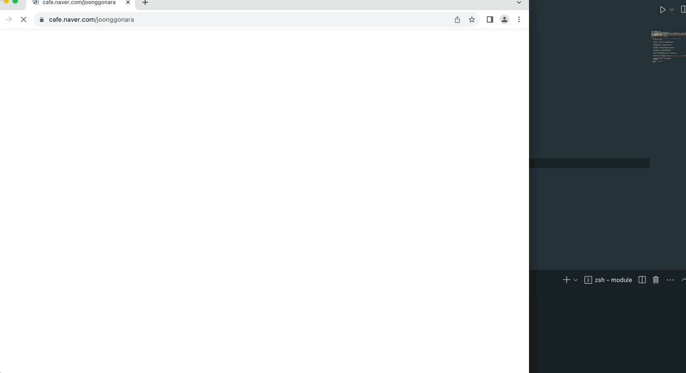
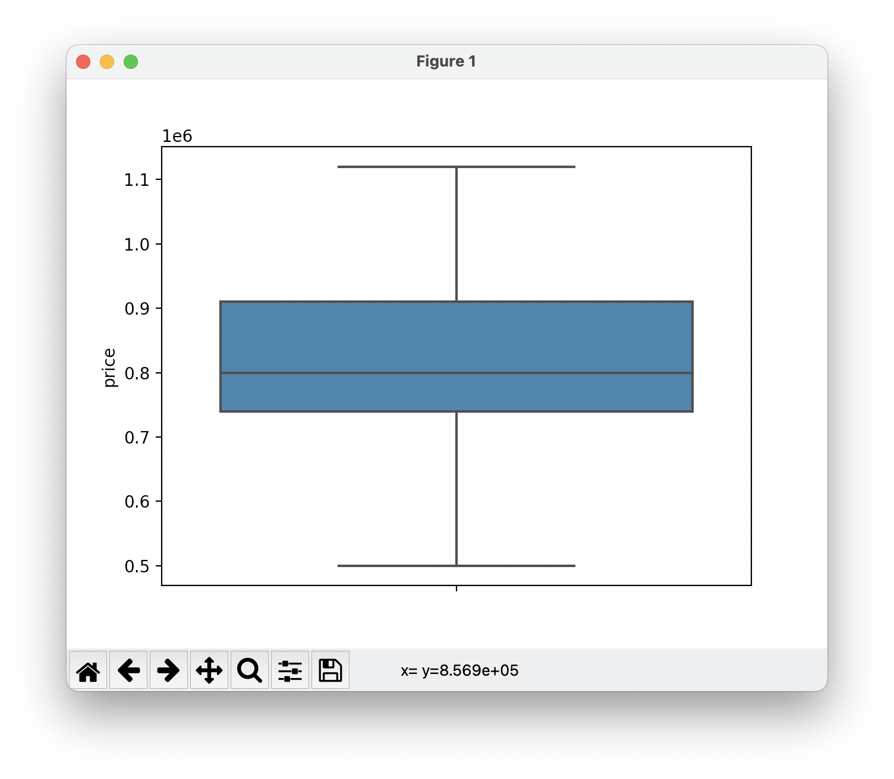
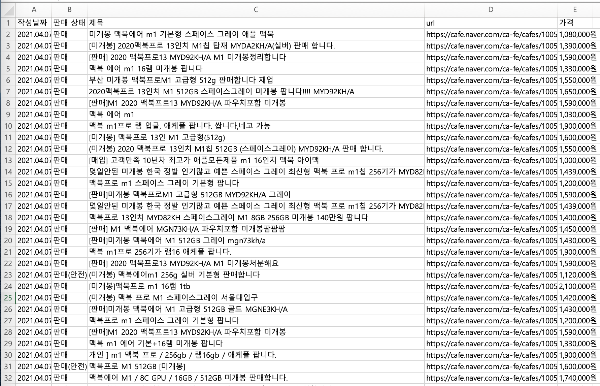

# 중고나라 크롤링 소스코드

## 사용법
1. 해당 링크[https://chromedriver.chromium.org/downloads]를 참고하여 WebDriver 를 설치하고 라이브러리를 설치한다.
2. module/defind.py 에 설치한 드라이버 경로(절대 경로) 를 포함하여 검색할 물건, 네이버 아이디, 비밀번호 등을 설정한다.
3. module/main.py 를 실행한다.

## 사용 예시

프로그램 실행시 위와 같은 작업이 자동으로 진행됩니다.

크롤링이 완료되면 위와 같이 박스 플롯으로 가격 분포가 나옵니다.

크롤링한 가격 정보 및 URL 은 엑셀로 정리되어 저장됩니다.

개발 과정은 아래 링크에서 확인할 수 있습니다.

https://flight-developer-stroy.tistory.com/4?category=975396

# 주의 사항
중고나라 사이트를 크롤링하는 행위가 불법 행위인지 의문이 생겨서 찾아본 결과 기본적으로 웹 크롤링은 불법적인 행위가 아니며, 이 프로그램을 상업적으로 이용하지 않았고 그 어떠한 금전적인 이득도 취하지 않아서 **불법적인 행위가 아니라고 판단**하였습니다.
현재 이 프로그램은 서버에 문제를 일으킬 만큼 방대한 데이터를 요청하고 있지는 않지만 코드를 수정해서 사용하실 분들은 서버에 부화를 일으킬 정도로 데이터를 요청하지 않도록 주의하시길 바랍니다. 만약 추후 문제가 발생한다면 해당 레포지토리를 삭제하겠습니다. 
[[참고링크]](https://brunch.co.kr/@8d1b089f514b4d5/33)
